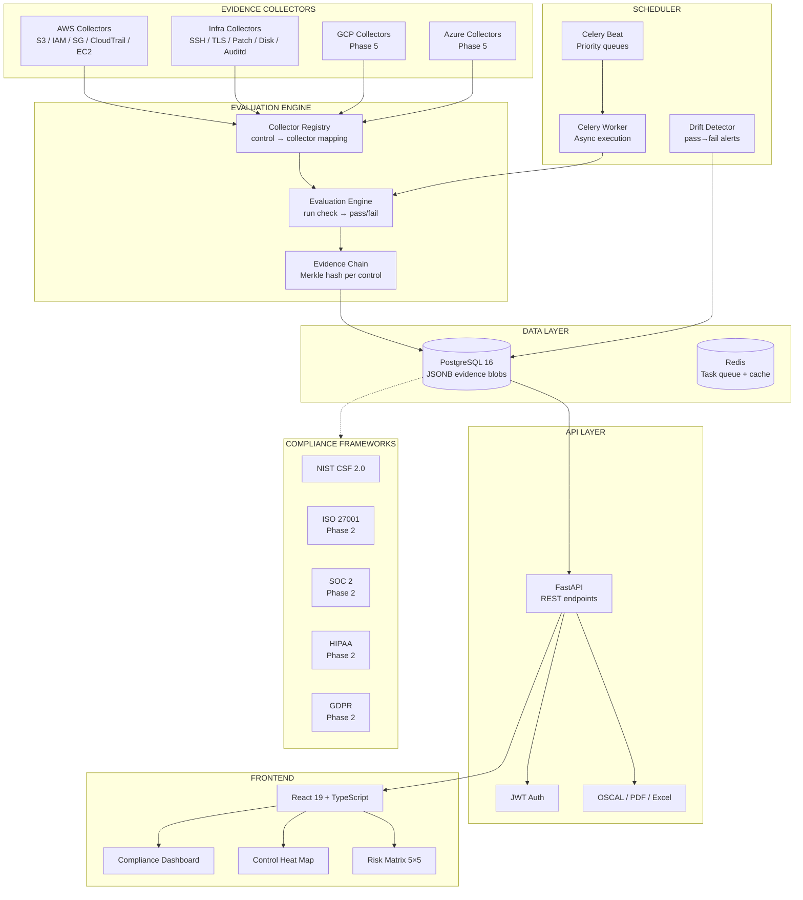
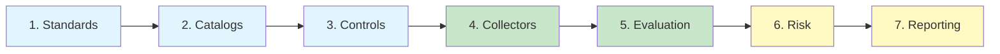

# Enterprise GRC Suite

Automated Governance, Risk, and Compliance auditing tool.

## Problem

Organizations spend an average of 11 weeks per year on manual compliance tasks. 59% list automating security and compliance as a top strategic priority. Existing solutions are either expensive enterprise suites ($50K–$100K+/year) or fragile spreadsheets. Teams struggle to:

- Collect and preserve evidence across cloud and infrastructure environments
- Map a single evidence set to multiple compliance frameworks (NIST CSF, ISO 27001, SOC 2, etc.)
- Detect compliance drift between audit cycles
- Produce evidence packages that auditors accept without back-and-forth

## Architecture

**Gemara 7-Layer Alignment**

Enterprise GRC Suite is a production-grade automated auditing platform built on the OpenSSF Gemara 7-layer GRC engineering model. It replaces manual evidence gathering with plugin-based collectors, maps all evidence through a Common Control Library (CCL) to any number of frameworks simultaneously, and continuously monitors for drift.

**Core capabilities:**

- **Plugin-based collectors** — standalone Python classes that gather evidence from cloud APIs (AWS, GCP, Azure), SSH targets, LDAP, and endpoints. Adding a new collector requires zero changes to core logic.
- **Multi-framework mapping** — a single piece of evidence is collected once and mapped to every relevant control across NIST CSF 2.0, ISO 27001, SOC 2, GDPR, HIPAA, and others via a bridge-table architecture. Eliminates per-framework duplicate work.
- **Tamper-evident evidence chain** — Merkle-style hash chain per control ensures auditors can verify evidence integrity from collection through presentation.
- **Continuous drift detection** — Celery Beat drives priority-queued re-checks (critical hourly, standard daily, low weekly). When a passing control fails, the system alerts immediately and records the drift event.
- **Auditor-ready output** — exports to NIST OSCAL (mandatory for FedRAMP by September 2026), PDF reports, and Excel. Every evidence package includes chain-of-custody hashes.
- **Configurable 5×5 risk matrix** — likelihood × impact scoring with severity mapping. Supports qualitative risk assessment per finding.

The platform is API-first, multi-tenant by design, and deployable via a single `docker compose up`.

## Tech Stack

| Component | Choice |
|-----------|--------|
| Backend | Python 3.12+ / FastAPI |
| Async Workers | Celery + Redis |
| Database | PostgreSQL 16 (JSONB for evidence blobs) |
| ORM | SQLAlchemy 2.0 + Alembic |
| Frontend | React 19 + TypeScript + Tailwind CSS |
| Visualization | Chart.js + react-chartjs-2 |
| Auth | JWT (Phase 6: OIDC/SAML) |
| Deployment | Docker Compose (dev), Kubernetes (prod) |
| Validation | Pydantic v2 |
| Cloud SDK | boto3 (AWS collectors) |
| Infrastructure | asyncssh (SSH collectors) |
